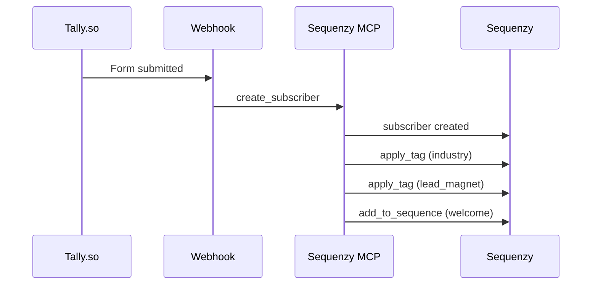

# Tether Docs — Sequenzy MCP for Clockout

> **Last updated:** June 19, 2026
> **Product:** Clockout — done-for-you automation for local service businesses
> **Platform:** Sequenzy (via MCP server)
> **API Key:** `seq_live_...` (in `.env` and `.mcp.json`)
> **MCP Server:** `npx -y @sequenzy/mcp`

---

## Table of Contents

1. [Overview](#1-overview)
2. [Getting Started](#2-getting-started)
3. [Subscriber Management](#3-subscriber-management)
4. [Tags & Segmentation](#4-tags--segmentation)
5. [Nurture Sequences](#5-nurture-sequences)
6. [Transactional Emails](#6-transactional-emails)
7. [Email Campaigns](#7-email-campaigns)
8. [Landing Pages](#8-landing-pages)
9. [Analytics](#9-analytics)
10. [Meta Audience Sync](#10-meta-audience-sync)
11. [Complete Workflow Playbooks](#11-complete-workflow-playbooks)
12. [MCP Tool Reference](#12-mcp-tool-reference)

---

## 1. Overview

### What This Is

The Tether Docs bridge Clockout's marketing strategy (the Allan Dib 1-Page Marketing Plan) with Sequenzy's platform. Every nurture sequence, lead capture flow, segment targeting move, and conversion email in the marketing plan is mapped to specific Sequenzy MCP tools.

### Why Sequenzy

Sequenzy provides a full-stack email marketing platform accessible entirely through an MCP server interface. This means every email operation — from creating a subscriber to triggering an automated sequence to measuring campaign performance — can be done through natural language commands in OpenCode/Claude Code.

### Current State of Clockout's Email System

| Area | Status | Priority |
|------|--------|----------|
| Lead capture (Tally.so) | Live, no Sequenzy integration | Immediate |
| Welcome/nurture sequences | None exist | Immediate |
| Tags & segmentation | None exist | Immediate |
| Industry segment targeting | None exist | Immediate |
| Lead magnet delivery | Manual/absent | Immediate |
| Assessment booking confirmation | Tally.so default only | Immediate |
| Day-30 re-engagement | None exist | Week 2 |
| Day-90 beta closing | None exist | Week 2 |
| Referral program | None exist | Week 3 |
| Analytics/attribution | None exist | Week 3 |
| Retargeting (Meta sync) | None exist | Week 3 |

### Key Design Decisions

- **One subscriber base, tagged by industry** — not separate lists per segment
- **7-email welcome sequence via Sequences** — not individual campaigns
- **Industry-specific email variants via tags** — one sequence, conditional content
- **Lead magnet delivery via transactional emails** — immediate, no delay
- **Score 1→9/10 on nurture** — from zero sequences to full automated pipeline

---

## 2. Getting Started

### Using the MCP Server

The Sequenzy MCP server is configured in `.mcp.json` at the project root. OpenCode connects to it automatically.

**Warm the server (first interaction):**
```
List all your Sequenzy subscribers.
```

**Basic command pattern:**
```
<action> <entity> <filters/fields>
```

### Testing Connectivity

```
List my subscriber tags.
```
Expected response: list of existing tags (initially empty or default).

### Environment

- API key: `seq_live_QJkaWhRnErI04XEmlhvphoq94XyuaEwIpy6ongA_TPU`
- All MCP tools available: subscribers, tags, segments, campaigns, sequences, transactional emails, landing pages, analytics, Meta audiences

---

## 3. Subscriber Management

### 3.1 Data Model

Every Clockout lead becomes a Sequenzy subscriber. Fields map to the marketing plan's lead record schema:

| Sequenzy Field | Marketing Plan Field | Source | Required |
|----------------|---------------------|--------|----------|
| `email` | Email | Tally.so form | ✅ |
| `first_name` | Name (first) | Tally.so form | ✅ |
| `last_name` | Name (last) | Tally.so form | optional |
| `phone` | Phone | Tally.so form | optional |
| `custom_field.industry` | Industry dropdown | Tally.so form | ✅ |
| `custom_field.company_size` | Company Size | Tally.so form | optional |
| `custom_field.pain_point` | Pain Point (multi-select) | Tally.so form | optional |
| `custom_field.lead_source` | Lead Source (UTM) | Auto-captured | auto |
| `custom_field.lead_magnet` | Lead Magnet downloaded | Auto-tagged | auto |
| `custom_field.lead_score` | Lead Score (0–10) | Calculated | auto |
| `custom_field.assessment_booked` | Yes/No | Webhook | auto |
| `custom_field.nps_score` | NPS (0–10) | Day 30 survey | auto |

### 3.2 Creating a Subscriber



**MCP command:**
```
Create a subscriber with:
- email: mike@example.com
- first_name: Mike
- phone: 815-555-0123
- custom_field.industry: HVAC
- custom_field.company_size: 2-5
- custom_field.pain_point: Missed calls, Quote follow-up
- custom_field.lead_magnet: 10-Hour Recovery Guide
```

### 3.3 Bulk Import

For importing existing contacts (beta waitlist, manual outreach):

```
Import subscribers from CSV:
email,first_name,industry,lead_source,notes
mike@hvacpros.com,Mike,HVAC,word-of-mouth,Known from Chamber
sarah@premierre.com,Sarah,Real Estate,referral,Existing contact
```

**Pro tip:** Tag all imports with `source:import` and `needs-welcome:true` so the welcome sequence triggers correctly.

### 3.4 Subscriber Lifecycle

```
Lead Magnet Download → Welcome Sequence (7 emails over 21 days)
                   → Tag: lead_magnet:guide
                   → Tag: needs_assessment:no (yet)

Assessment Booked    → Remove from welcome sequence (if mid-sequence)
                   → Tag: assessment:booked
                   → Transactional: confirmation + calendar link
                   → SMS: 24-hour reminder

Assessment Attended  → Tag: assessment:done
                   → Tag: needs_audit:yes
                   → Move to audit follow-up sequence

Audit Delivered      → Tag: audit:delivered
                   → Tag: needs_proposal:yes

Proposal Sent        → Tag: proposal:sent
                   → Tag: stage:negotiation

Build Started        → Tag: build:active
                   → Remove from marketing sequences
                   → Transactional: daily build updates

Handover Complete    → Tag: customer:active
                   → Tag: nps:needed
                   → Day 7 check-in sequence
                   → Day 30 NPS survey
                   → Day 90 QBR sequence

Churned/Passed       → Tag: customer:churned
                   → Win-back sequence (30/60/90)
```

---

## 4. Tags & Segmentation

### 4.1 Tag Taxonomy

Tags are the backbone of Clockout's segmentation. Every subscriber gets tagged on creation and throughout their lifecycle.

#### Industry Tags (Applied on Creation)

| Tag | Segment | Priority |
|-----|---------|----------|
| `industry:hvac` | HVAC | Tier 1 |
| `industry:plumbing` | Plumbing | Tier 1 |
| `industry:roofing` | Roofing | Tier 1 |
| `industry:electrical` | Electrical | Tier 1 |
| `industry:real-estate` | Real Estate Agents | Tier 1 |
| `industry:property-mgmt` | Property Managers | Tier 1 |
| `industry:professional-services` | Insurance, Finance, Tax | Tier 2 |
| `industry:cleaning` | Cleaning Services | Tier 2 |
| `industry:landscaping` | Landscaping | Tier 2 |
| `industry:other` | General/Other | Tier 3 |

#### Lead Magnet Tags (Applied on Download)

| Tag | Lead Magnet |
|-----|-------------|
| `magnet:10hr-guide` | "The 10-Hour Recovery Guide" PDF |
| `magnet:leak-report` | Leak Calculator full report |
| `magnet:assessment` | Free 20-min Assessment Call |

#### Lifecycle Tags (Applied by Automation)

| Tag | Meaning |
|-----|---------|
| `needs_assessment:yes` | Ready for assessment ask |
| `assessment:booked` | Booked but not attended |
| `assessment:done` | Completed assessment call |
| `needs_audit:yes` | Ready for audit booking |
| `audit:delivered` | Audit report sent |
| `proposal:sent` | Proposal sent, awaiting decision |
| `proposal:accepted` | Deal closed |
| `proposal:lost` | Lost deal |
| `build:active` | Currently in build phase |
| `customer:active` | Post-handover customer |
| `customer:churned` | Lost customer |
| `nps:detractor` | NPS 0-6 |
| `nps:passive` | NPS 7-8 |
| `nps:promoter` | NPS 9-10 |

#### Behavioral Tags (Applied by Automation)

| Tag | Trigger |
|-----|---------|
| `engaged:high` | Opened 3+ emails in last 14 days |
| `engaged:low` | No opens in 30 days |
| `needs_reengagement` | No opens in 60 days |
| `lead_hot` | Lead score >= 7 |
| `lead_warm` | Lead score 4-6 |
| `lead_cold` | Lead score 0-3 |

### 4.2 Creating Tags

```
Create a tag called "industry:hvac" with description "HVAC contractors".
Create a tag called "industry:plumbing" with description "Plumbers".
Create a tag called "assessment:booked" with description "Assessment call booked".
Create a tag called "lead_hot" with description "Lead score >= 7".
```

### 4.3 Creating Segments

Segments are dynamic groups based on tag and field conditions. These power every campaign and sequence.

**Industry segments (one per industry):**
```
Create a segment called "HVAC Leads" with conditions:
  - has tag "industry:hvac"
  - does NOT have tag "customer:active"
  - does NOT have tag "customer:churned"
```

**Hot leads (ready for direct outreach):**
```
Create a segment called "Hot Leads" with conditions:
  - has tag "lead_hot"
  - does NOT have tag "assessment:booked"
  - does NOT have tag "customer:active"
```

**Lead magnet downloaders (need nurture):**
```
Create a segment called "Guide Downloaders" with conditions:
  - has tag "magnet:10hr-guide"
  - OR has tag "magnet:leak-report"
  - does NOT have tag "assessment:booked"
  - does NOT have tag "assessment:done"
```

**Assessment booked (need confirmation):**
```
Create a segment called "Assessment Booked" with conditions:
  - has tag "assessment:booked"
  - does NOT have tag "assessment:done"
```

**Beta closing (Day 90 outreach):**
```
Create a segment called "Beta Closing - No Action" with conditions:
  - created before 90 days ago
  - does NOT have tag "assessment:booked"
  - does NOT have tag "assessment:done"
  - does NOT have tag "customer:active"
```

**Active customers (post-build communications):**
```
Create a segment called "Active Customers" with conditions:
  - has tag "customer:active"
```

**NPS survey targets (Day 30):**
```
Create a segment called "NPS Day 30" with conditions:
  - has tag "customer:active"
  - has tag "nps:needed"
```

---

## 5. Nurture Sequences

### 5.1 The 7-Email Welcome Sequence

This is Clockout's primary nurture pipeline. Triggered by any lead capture event (lead magnet download, calculator submission).

**Segment targeting:** All new leads (tagged by industry)
**Goal:** Nurture to assessment booking
**Timing:** 7 emails over 21 days
**Cadence rule:** Max 2 emails in 5 days without a value piece between them
**Ratio:** 3 value : 1 soft ask : 1 direct ask (rolling 5 touches)

Create the sequence:

```
Create a sequence called "Clockout Welcome - 7 Day Nurture" with triggers:
  - Subscriber created
  - Tag added: needs_assessment:yes
```

Then add each email step. Use `add_email_to_sequence` or similar tool for each.

---

#### Email 1: Immediate — Delivery + Value

| Field | Value |
|-------|-------|
| **Subject** | "Your [resource] — and one more thing" |
| **Delay** | 0 minutes (immediate) |
| **Goal** | Deliver resource + plant seed |

**Body template:**

```
Hi {{first_name}},

Here's your [resource name — "10-Hour Recovery Guide" / "Leak Report"].

One insight you can use in 5 minutes:

[Segment-specific stat — "62% of calls to HVAC shops go unanswered." / "The average agent takes 47 minutes to respond to a lead." / "15% of tenants churn at renewal because nobody followed up at 60 days."]

Talk to whoever's handling your calls this week and ask: "How many did we miss?"

The answer might surprise you.

If you want to see how much your business is really leaking, here's 20 minutes:
{{assessment_link}}

— Donovin

P.S. The free assessment finds $10K+ in leaks or I work for free. That's the guarantee.
```

---

#### Email 2: Day 2 — Industry-Specific Pain

| Field | Value |
|-------|-------|
| **Subject** | "[Segment leak] most [segment] owners ignore" |
| **Delay** | 2 days |
| **Goal** | Educate with real stats |

**Conditional content by industry tag:**

**HVAC variant:**
```
Subject: The $5,400/month call leak most HVAC shops ignore

Hi {{first_name}},

Let me guess: you're on a roof or in a crawlspace, the shop phone rings, and by the time you're free, there's no voicemail.

That's not just annoying. That's $5,400/month walking out the door.

{{stat_card:
- 62% of calls to home service businesses go unanswered
- 86% of callers who hit voicemail never leave a message
- Average HVAC ticket: $450
- Math: 3 missed calls/week × $450 × 4 weeks = $5,400/month
}}

What if every call got answered, every quote got followed up, and every customer got asked for a review — automatically, inside the tools you already use?

That's what I build in 9 days. Flat price. You own it.

{{cta: See how much your shop is leaking →}}
```

**Real Estate variant:**
```
Subject: The average agent loses 30% of leads to slow response

Hi {{first_name}},

You had an open house on Sunday. 14 people walked through. You called 6 that night.

By Tuesday, 3 had already booked with another agent.

That's not bad luck. That's a system gap.

{{stat_card:
- Average agent takes 47 minutes to respond to a lead
- <5 minute response = 8x higher conversion
- 93% of database contacts receive zero outreach
- Average commission lost per abandoned lead: $127K/year
}}

What if every lead got an auto-response in <60 seconds — even while you're showing another house?

That's what I build in 9 days. Flat price. You own it.

{{cta: See how much your leads are worth →}}
```

**Property Management variant:**
```
Subject: 15% of tenants lost to 'we forgot to send the renewal'

Hi {{first_name}},

Maintenance requests come in by text, email, and phone. Lease renewals are manual. Half your team's day is just triaging.

And every month, tenants slip through because nobody followed up at the right time.

{{stat_card:
- 12+ hrs/week lost to maintenance coordination per manager
- 52% of PMs still on manual processes
- #1 tenant complaint: "no one responds to my maintenance requests"
- 15% of tenants churn at renewal — preventable
}}

What if maintenance requests auto-triaged, lease renewals auto-fired, and tenants stopped texting your cell at 9pm?

That's what I build in 9 days. Flat price. You own it.

{{cta: See how much your manual processes cost →}}
```

---

#### Email 3: Day 4 — Emotional (The Outcome)

| Field | Value |
|-------|-------|
| **Subject** | "What would you do with 10 extra hours a week?" |
| **Delay** | 4 days |
| **Goal** | Build desire for the outcome |

**Body template:**

```
Hi {{first_name}},

Be honest — when's the last time you had a Sunday that was actually yours?

Not "catching up on quotes." Not "doing the books." Not "answering emails from bed."

A Sunday where you didn't think about the business at all.

One owner I worked with said it best:
> "I forgot what a Sunday felt like. Now I spend them with my kids. The business runs itself."

10 hours a week doesn't sound like much. But it's:

• A full workday back — every week
• Sunday evenings that belong to you
• A phone that doesn't ring at dinner
• The feeling that the business works for you, not the other way around

All it takes is one 48-hour audit to find every leak. Then 7 days to build the fix.

You own it. No subscription. No lock-in.

If the system doesn't give you 10 hours a week back in 30 days, I keep working until it does.

{{cta: Get your 10 hours back →}}
```

---

#### Email 4: Day 7 — Self-Diagnosis

| Field | Value |
|-------|-------|
| **Subject** | "3 signs your business runs you (not the other way around)" |
| **Delay** | 7 days |
| **Goal** | Self-diagnosis + urgency |

**Body template:**

```
Hi {{first_name}},

Here's a quick self-check. How many apply to you?

☐ You can't take a day off without something falling through the cracks
☐ You know exactly where the money is leaking but you're too busy to fix it
☐ You spend your Sundays doing data entry

If two or more are checked, your business is running you — not the other way around.

Here's the thing: this isn't normal. And it's not "just how it is in this industry."

It's a system gap. And it's fixable.

The 9-Day Time Recovery System:
1. 48-hour audit — I find every leak, priced in dollars
2. 7-day build — I install the automations inside your existing tools
3. Handover — You own everything. Docs, logins, source code. No lock-in.

The guarantee: If I can't find $10K in fixable leaks, the audit is free. If the system doesn't save you 10 hrs/week, I keep working until it does.

{{cta: Book your free 20-min assessment →}}
```

---

#### Email 5: Day 10 — Composite Case Study

| Field | Value |
|-------|-------|
| **Subject** | "How a [segment peer] recovered $X/mo in 7 days" |
| **Delay** | 10 days |
| **Goal** | Alternative social proof |

**Body template (HVAC variant):**

```
Hi {{first_name}},

Take a typical HVAC shop in the Rockford area. 4 techs. 1 dispatcher. The owner works in the field.

Before Clockout:
• 3–5 calls/day go unanswered ($5,400/month)
• 60% of cold quotes never followed up ($3,200/month in recovery)
• Reviews asked for manually — maybe (2.5 stars average)
• Owner spends Sunday doing payroll + data entry

After Clockout (7-day build):
• Every call captured — missed-call rescue SMS in <30 seconds
• Auto-follow-up on every quote — 3 touches over 10 days
• Review requests fire automatically after every job
• Payroll synced — no Sunday data entry

Total revenue recovered: ~$8,600/month
Time saved: 10+ hours/week

*Based on aggregate industry data and benchmarks. No single client's results.*

Your numbers might be different — probably higher.

{{cta: Find your leaks in 48 hours →}}
```

---

#### Email 6: Day 14 — Direct Pitch

| Field | Value |
|-------|-------|
| **Subject** | "Your free assessment is waiting — here's what to expect" |
| **Delay** | 14 days |
| **Goal** | Conversion |

**Body template:**

```
Hi {{first_name}},

You've been reading my emails for two weeks. Let me show you what happens on the assessment call — it's low-pressure, I promise.

Here's exactly what to expect:

**① Tell me about your business (5 min)**
What do you do? How long? What's working? What's not?

**② I walk through your workflow and find leaks (10 min)**
We trace one real job from lead to invoice. Every leak gets priced in dollars.

**③ We estimate the dollar impact (3 min)**
"Based on what you're telling me, you're losing roughly $X/month to missed calls, cold quotes, and manual admin."

**④ If it's a fit, we book the audit (2 min)**
If not, you get a free diagnosis anyway. No pressure. No pitch.

**FAQ:**
**Q: Do I need to prepare anything?**
A: Nope. Just show up and tell me about your business.

**Q: How long does it actually take?**
A: 20 minutes. Hard stop.

**Q: What if I don't want to do the audit after?**
A: Then you got a free 20-min consultation. Keep what's useful. No obligation.

**Q: What if you can't find $10K in leaks?**
A: Then the audit is free. I only get paid if I find money on the table.

{{cta: Book my free assessment →}}
```

---

#### Email 7: Day 21 — Scarcity Close

| Field | Value |
|-------|-------|
| **Subject** | "Last chance at beta pricing" |
| **Delay** | 21 days |
| **Goal** | Urgency close |

**Body template:**

```
Hi {{first_name}},

Beta pricing ($497) is for the first 15 clients.

The standard price for the 9-Day Time Recovery System is $1,494. Same build. Same guarantee. Same ownership. Higher price.

Here's what $497 gets you:
• 48-hour operational audit (quantified in dollars)
• 7-day custom automation build (inside your existing tools)
• Complete handover (you own everything — docs, logins, code)
• 30-day satisfaction guarantee (10 hrs/week or free)

Here's what it doesn't get you:
• A subscription
• A monthly bill
• Lock-in
• "Talk to sales" nonsense

{{remaining_spots}} beta spots left at $497. After that, it's $1,494.

{{cta: Claim beta pricing →}}

If now's not the right time, no hard feelings. The offer is here when you're ready — just at the standard price.

— Donovin
```

---

### 5.2 Assessment Sequence

Triggered when `assessment:booked` tag is applied.

```
Create a sequence called "Clockout Assessment Flow" with triggers:
  - Tag added: assessment:booked
```

**Step 1: Confirmation (Immediate)**
- **Subject:** "Your assessment is confirmed — see you [day/time]"
- **Content:** Calendar link, prep info, "here's what to expect"
- **Note:** This should be a transactional email (separate from nurture)

**Step 2: Day-before reminder (SMS, 24 hours before)**
```
Hi {{first_name}}, quick reminder — our assessment call is tomorrow at {{time}}.
Link: {{calendar_link}}
See you then!
— Donovin
```

**Step 3: Post-call follow-up (1 hour after)**
- **Subject:** "Great talking — here's what we covered"
- **Content:** Summary of leaks discussed, next steps, link to book audit

**No-show recovery (if applicable):**
- SMS at +1 hour: `"Hey {{first_name}}, missed our call. No worries. Reschedule here: {{link}}"`
- Email at +24 hours: "Missed you yesterday — your assessment is still open"
- Phone call at +48 hours: Founder calls personally

### 5.3 Build Phase Sequence

Triggered when `build:active` tag is applied.

```
Create a sequence called "Clockout Build Updates" with triggers:
  - Tag added: build:active
```

- **Day 1:** Kickoff confirmation + daily update format
- **Days 2–7:** Daily progress emails (what was built, what's next)
- **Day 8:** Handover prep + training call link
- **Day 9:** "You own your system" — video walkthrough, docs, credentials

### 5.4 Post-Handover Sequence

Triggered when `customer:active` tag is applied.

```
Create a sequence called "Clockout Post-Handover" with triggers:
  - Tag added: customer:active
```

- **Day 7:** Check-in — "How's the system working?"
- **Day 30:** NPS survey + "We'd love a review" (referral ask)
- **Day 90:** Quarterly Business Review link
- **Day 365:** Anniversary — "One year with your system"

### 5.5 Re-Engagement Sequence

Targets subscribers tagged `needs_reengagement`.

```
Create a sequence called "Clockout Re-Engagement" with trigger:
  - Tag added: needs_reengagement
  - OR segment: No opens in 60 days
```

- **Day 0:** "Still out there?" — Light touch, value piece
- **Day 7:** "Beta's still open" — Scarcity + testimonial
- **Day 30:** "Last email — unless you want more" — Final touch, soft close

### 5.6 Transactional Emails

These fire in response to specific actions, not via sequences.

| Trigger | Content | Channel |
|---------|---------|---------|
| Lead magnet downloaded | Deliver PDF + "one more thing" | Email (immediate) |
| Calculator used + email given | Full report + benchmarks | Email (immediate) |
| Assessment booked | Confirmation + calendar link + prep guide | Email + SMS |
| Assessment no-show | Recovery SMS + email + call | SMS > Email > Call |
| Proposal sent | Proposal PDF + walkthrough link | Email |
| Build kickoff | Welcome + daily update format | Email |
| Handover complete | Credentials + docs + training link | Email |

---

## 6. Transactional Emails

### 6.1 Lead Magnet Delivery

Use transactional templates (not sequences) for immediate delivery.

**Template: 10-Hour Recovery Guide Delivery**

```
Subject: Your 10-Hour Recovery Guide

Hi {{first_name}},

Here's your copy of "The 10-Hour Recovery Guide: How local business owners reclaim 10 hours a week by plugging 5 common operational leaks."

📄 [Download PDF link]

One thing to try this week:
Pick one of the five leaks and time how much it costs you in one day. You might be surprised.

Want to know exactly how much your business is leaking? The free assessment finds the dollar figure in 48 hours.

{{cta: Book your free assessment →}}

— Donovin
```

**Template: Leak Report Delivery**

```
Subject: Your custom leak report — with industry benchmarks

Hi {{first_name}},

Here's the full breakdown from your Leak Calculator:

📊 [Report PDF link]

Your estimated monthly revenue loss: ~${{leak_amount}}/month

Industry benchmarks ({{industry}}):
• Average missed calls/week: {{avg_missed}}
• Average quote recovery rate: {{avg_recovery}}%
• Average admin hours/week: {{avg_admin_hours}}

Want to see how this compares to similar businesses in a personalized 20-min audit?

{{cta: Book your free assessment →}}

— Donovin
```

### 6.2 Assessment Confirmation

```
Subject: Confirmed — your Clockout assessment is booked

Hi {{first_name}},

You're all set.

📅 **Date:** {{date}}
⏰ **Time:** {{time}}
📞 **Link:** {{video_link}}
⏱ **Duration:** 20 minutes (hard stop)

**What to expect:**
1. Tell me about your business
2. I walk through your workflow and find leaks
3. We estimate the dollar impact
4. If it's a fit, we book the audit

**No prep needed.** Just show up and tell me about your business.

If anything comes up, reply to this email.

— Donovin

P.S. If the audit doesn't find $10K in fixable leaks, you don't pay. That's the guarantee.
```

### 6.3 Post-Assessment Follow-Up

```
Subject: Great talking — here's what we covered

Hi {{first_name}},

Thanks for the call. Here's what I heard:

📋 **Leaks identified:**
• [Leak 1]: ~$X/month
• [Leak 2]: ~$X/month
• [Leak 3]: ~$X/month

**Next steps:**

If you want to move forward with the full audit, here's the link to book your 2-hour discovery call:
📅 {{audit_booking_link}}

The audit takes 48 hours. You get a written report with every leak priced in dollars. If I don't find $10K, it's free.

No pressure — the offer is here when you're ready.

— Donovin
```

### 6.4 SMS Templates

**Assessment reminder (24 hours before):**
```
Hey {{first_name}} — quick reminder, we've got our assessment call tomorrow at {{time}}. Here's the link: {{link}}. See you then! — Donovin
```

**Post-assessment recap:**
```
Just sent your assessment recap by email. TL;DR: ~$X/month in fixable leaks. Want to book the audit? {{link}} — Donovin
```

**No-show recovery:**
```
Hey {{first_name}}, missed our call. No worries. Here's a link to reschedule: {{link}} Still interested? — Donovin
```

**Build kickoff:**
```
Build day 1 starts today. You'll get a daily email update. Questions? Reply anytime. — Donovin
```

**Handover complete:**
```
Your system is live 🎉 You own it. Check your email for docs + login. So... what are you doing with your first free Sunday? 😎 — Donovin
```

---

## 7. Email Campaigns

One-off broadcast campaigns for announcements, seasonal triggers, and special events.

### 7.1 Beta Opening Campaign

**Segment:** All subscribers tagged `lead_hot` or `lead_warm` (existing contacts)
**Subject:** "Clockout is live — first 15 at beta pricing"
**Timing:** One-time broadcast

### 7.2 Seasonal Campaigns

Per industry segment, tied to seasonal triggers from the marketing plan:

| Segment | Season | Subject Idea |
|---------|--------|-------------|
| HVAC | Spring | "AC tune-up season is coming. Are your leads ready?" |
| HVAC | Fall | "Pre-winter inspection season — don't miss the surge" |
| Plumbing | Winter | "Pipe burst season prep — every call matters" |
| Roofing | Spring | "Storm season is here — speed-to-lead wins the job" |
| Real Estate | Spring/Fall | "Peak market season — your leads won't wait" |
| Property Mgmt | Lease cycle | "Q4 renewals start now — automate the follow-up" |

### 7.3 Referral Campaign

**Segment:** Active customers (tag: `customer:active`, NPS >= 9)
**Subject:** "Know another business owner who needs this?"
**Timing:** Day 30 post-handover + recurring quarterly

**Body idea:**
```
Hi {{first_name}},

You've been running your system for {{days}} days. How's it going?

If you know another local business owner who's drowning in admin, I'd love to help them too.

For every referral who books an assessment, I'll [referral incentive — discount, gift card, etc.].

{{cta: Send a referral →}}

— Donovin
```

### 7.4 Pricing Announcement

**Segment:** All non-customer leads
**Subject:** "Beta pricing ends when spot 15 fills — {{spots_left}} left"
**Timing:** Ongoing scarcity campaign

---

## 8. Landing Pages

Sequenzy can host landing pages for lead capture. Use these for segment-specific campaigns.

### 8.1 Segment Landing Pages

Each page targets a specific industry with tailored copy, stats, and messaging.

| URL Path | Segment | Headline |
|----------|---------|----------|
| `/for-hvac` | HVAC | "62% of calls to HVAC shops go unanswered" |
| `/for-plumbing` | Plumbing | "550K fewer plumbers by 2027 — can you afford to lose a single lead?" |
| `/for-roofing` | Roofing | "Your competitor responded to that storm lead in 4 minutes" |
| `/for-electrical` | Electrical | "2 hours/day per tech lost to admin — that's 25% of your capacity" |
| `/for-real-estate` | Real Estate | "You lost 3 buyers today because you called back 20 minutes late" |
| `/for-property-management` | Property Mgmt | "Your tenants are texting your cell at 9pm" |
| `/for-insurance` | Professional Services | "You're losing 30% of renewals to 'I forgot to send the reminder'" |

### 8.2 Lead Magnet Landing Pages

| URL Path | Lead Magnet | Capture Fields |
|----------|-------------|---------------|
| `/10-hour-guide` | "10-Hour Recovery Guide" PDF | Email only (low friction) |
| `/leak-calculator` | Leak Calculator + Report | Name + email + phone + industry (medium friction) |
| `/assessment` | Free Assessment Call | Full contact + industry + size + pain (high friction) |

### 8.3 Landing Page Best Practices

- Every page has the Meta retargeting pixel
- Every page tags the subscriber by industry on submit
- Every page feeds into the same welcome sequence (segmented)
- Every page has a guarantee section (risk reversal)
- Forms have a "Biggest pain point" dropdown for qualification

---

## 9. Analytics

Use Sequenzy's analytics tools to measure campaign performance and optimize.

### 9.1 Key Metrics to Track

| Metric | Where to Find It | Benchmark | Target |
|--------|-----------------|-----------|--------|
| Email open rate | Campaign/sequence analytics | ~20-25% (industry) | 30%+ |
| Click-through rate | Campaign/sequence analytics | ~2-3% (industry) | 5%+ |
| Unsubscribe rate | Campaign/sequence analytics | <0.5% | <0.2% |
| Sequence conversion rate | Sequence analytics | N/A | 3-5% to assessment |
| Subscriber growth rate | Analytics dashboard | N/A | Weekly trend |
| Segment size trends | Segment analytics | N/A | Growing per industry |

### 9.2 Analytics Queries

```
Show me the open rate for the "Clockout Welcome - 7 Day Nurture" sequence.
Show me click-through rates per email in the welcome sequence.
Show me subscriber growth by industry segment this month.
Show me which lead magnet converts best to assessment booking.
```

### 9.3 A/B Testing

Test subject lines on high-volume emails:

- **Email 1 subject lines:** "Your guide — and one more thing" vs. "Here's your 10-Hour Recovery Guide"
- **Email 3 subject lines:** "What would you do with 10 extra hours?" vs. "Sunday freedom is closer than you think"
- **Email 7 subject lines:** "Last chance at beta pricing" vs. "Beta ends at 15 spots — {{spots}} left"

---

## 10. Meta Audience Sync

Sequenzy can sync subscriber segments to Meta (Facebook/Instagram) for retargeting.

### 10.1 Retargeting Audiences

| Audience | Segment Source | Ad Purpose | Budget |
|----------|---------------|------------|--------|
| **Website visitors (non-converters)** | Meta pixel on all pages | "Still thinking?" retargeting | $5-10/day |
| **Guide downloaders** | Tag: `magnet:10hr-guide` | "Next step: free assessment" | $5-10/day |
| **Assessment no-shows** | Tag: `assessment:booked` (no `assessment:done`) | "Missed you — reschedule?" | $5/day |
| **Proposal sent, no response** | Tag: `proposal:sent` (7+ days) | "Any questions?" objection-handler | $5/day |
| **Active customers** | Tag: `customer:active` | Lookalike audience seed | $10-20/day |
| **High-value ICP lookalike** | Industry Tier 1 subscribers | New lead acquisition | $20-50/day |

### 10.2 MCP Commands

```
Create a Meta audience named "Clockout - Guide Downloaders" synced from segment "Guide Downloaders".
Create a Meta audience named "Clockout - Assessment No-Shows" synced from segment "Assessment Booked - No Show".
Create a Meta audience named "Clockout - High-Value Lookalike" synced from segment "Active Customers" as a lookalike (1%).
```

---

## 11. Complete Workflow Playbooks

### Playbook 1: Lead Captures via Tally.so → Sequenzy

**Trigger:** Tally.so form submission
**Action block:**

1. **Create subscriber** with all form fields
2. **Apply industry tag** based on dropdown selection
3. **Apply lead magnet tag** based on what was downloaded
4. **Send transactional email** with the resource
5. **Add to welcome sequence** (if not assessment-booked)
6. **Update lead score** based on fields provided

```
When a new subscriber is created from Tally.so assessment form:
  1. Create subscriber (email, name, phone, industry, company_size, pain_point)
  2. Apply tag: industry:{{industry}}
  3. Apply tag: magnet:assessment
  4. Send transactional email "Assessment Confirmation"
  5. Add to sequence "Clockout Assessment Flow"
  6. Set custom_field.lead_score = 5 (base for assessment bookers)
```

### Playbook 2: Welcome Sequence Enrollment

**Trigger:** Any subscriber created (not from assessment)
**Action block:**

1. **Check if assessment booked** — if not, add to welcome sequence
2. **Apply `needs_assessment:yes` tag** after 14 days if no engagement
3. **Re-score lead** weekly based on email engagement

### Playbook 3: Lead Scoring Automation

Run weekly to update lead scores:

| Criteria | Points Change |
|----------|--------------|
| Industry in Tier 1 (HVAC, Plumbing, Roofing, Electrical, Real Estate, Property Mgmt) | +3 |
| Industry in Tier 2 (Professional Services) | +2 |
| Company size 1-10 | +1 |
| Phone provided | +1 |
| Pain point selected | +1 |
| Opened 3+ emails in 14 days | +1 |
| Clicked CTA in email | +2 |
| Assessement booked | +2 |
| Assessment attended | +2 |
| Unsubscribed | -10 |
| No opens in 30 days | -2 |

### Playbook 4: Quarterly Re-Engagement

Run every 90 days:

1. **Segment:** Subscribers created 90+ days ago, no assessment, no unsubscribe
2. **Tag:** `needs_reengagement`
3. **Add to re-engagement sequence** (3 emails over 30 days)
4. **After sequence:** If no engagement, remove from active sequences (keep as subscriber for future campaigns)

### Playbook 5: NPS Collection

**Trigger:** 30 days post-handover (tag `customer:active` + `nps:needed`)
**Action block:**

1. **Send NPS survey** (0-10 scale)
2. **Apply response tag:**
   - 0-6 → `nps:detractor` → Trigger founder intervention sequence
   - 7-8 → `nps:passive` → Trigger "How can we improve?" sequence
   - 9-10 → `nps:promoter` → Trigger referral request sequence
3. **Remove `nps:needed` tag**
4. **Schedule next NPS** at Day 90

### Playbook 6: Referral Program

**Trigger:** Tag `nps:promoter` applied
**Action block:**

1. **Send referral request email** — "Know someone who needs this?"
2. **Provide unique referral link** (trackable)
3. **On referral assessment booked:** Send referrer reward notification
4. **On referral converted (customer:active):** Deliver referrer reward

---

## 12. MCP Tool Reference

### Subscriber Tools

| Tool | Purpose | Used For |
|------|---------|----------|
| `create_subscriber` | Add a new contact | All lead capture |
| `update_subscriber` | Update fields/score | Lead scoring, lifecycle |
| `delete_subscriber` | Remove a contact | GDPR compliance |
| `get_subscriber` | Look up a contact | Verification |
| `list_subscribers` | Browse contacts | Audits, exports |
| `import_subscribers` | Bulk upload | Beta waitlist migration |
| `export_subscribers` | Download contacts | Backup, analysis |

### Tag Tools

| Tool | Purpose | Used For |
|------|---------|----------|
| `create_tag` | Define a new tag | Taxonomy setup |
| `list_tags` | View all tags | Reference |
| `apply_tag` | Tag a subscriber | Every lifecycle event |
| `remove_tag` | Untag a subscriber | Lifecycle transitions |

### Segment Tools

| Tool | Purpose | Used For |
|------|---------|----------|
| `create_segment` | Define dynamic group | Industry segments, lifecycle |
| `list_segments` | View all segments | Reference |
| `get_segment_subscribers` | List segment members | Campaign targeting |

### Sequence Tools

| Tool | Purpose | Used For |
|------|---------|----------|
| `create_sequence` | Build automated drip | Welcome, nurture, post-handover |
| `list_sequences` | View all sequences | Reference |
| `add_email_to_sequence` | Add email step | Sequence construction |
| `update_sequence_email` | Edit email step | A/B testing, optimization |
| `remove_email_from_sequence` | Delete email step | Maintenance |
| `get_sequence_stats` | Performance data | Analytics |

### Campaign Tools

| Tool | Purpose | Used For |
|------|---------|----------|
| `create_campaign` | One-time broadcast | Seasonal, announcements |
| `list_campaigns` | View all campaigns | Reference |
| `get_campaign_stats` | Performance data | Analytics |

### Transactional Email Tools

| Tool | Purpose | Used For |
|------|---------|----------|
| `create_transactional_template` | Build email template | Lead magnet delivery, confirmations |
| `send_transactional_email` | Fire immediate email | Instant responses |
| `list_transactional_templates` | View templates | Reference |

### Landing Page Tools

| Tool | Purpose | Used For |
|------|---------|----------|
| `create_landing_page` | Build capture page | Segment landing pages |
| `list_landing_pages` | View all pages | Reference |
| `get_landing_page_stats` | Performance data | Conversion tracking |

### Analytics Tools

| Tool | Purpose | Used For |
|------|---------|----------|
| `get_dashboard_stats` | Overall metrics | Weekly review |
| `get_campaign_stats` | Campaign-specific | A/B test results |
| `get_sequence_stats` | Sequence performance | Nurture optimization |
| `get_subscriber_growth` | Growth trends | Pipeline health |

### Meta Audience Tools

| Tool | Purpose | Used For |
|------|---------|----------|
| `create_meta_audience` | Sync to Facebook | Retargeting |
| `list_meta_audiences` | View synced audiences | Reference |
| `get_meta_audience_stats` | Audience performance | Retargeting optimization |

---

## Appendix A: Quick Reference — Marketing Plan to Sequenzy Map

| Marketing Plan Square | Score → Target | Sequenzy Feature | Priority |
|-----------------------|---------------|------------------|----------|
| **4. Capture Leads** | 3→9 | Landing pages + transactional + tags | Immediate |
| **5. Nurture Leads** | 1→9 | Sequences (7-email) + segments | Immediate |
| **6. Convert** | 4→9 | Transactional + lead scoring + analytics | Immediate |
| **7. Experience** | 2→9 | Sequences (post-handover) + NPS | Week 2 |
| **9. Referrals** | 1→9 | Sequences + NPS tags + referral campaigns | Week 3 |

## Appendix B: Naming Convention

| Entity | Convention | Example |
|--------|-----------|---------|
| Tags | `category:value` (lowercase, hyphenated) | `industry:hvac`, `magnet:10hr-guide` |
| Segments | Pascal Case — descriptive | "HVAC Leads", "Hot Leads - Needs Assessment" |
| Sequences | "Clockout [Purpose] — [Detail]" | "Clockout Welcome — 7 Day Nurture" |
| Campaigns | "[Goal] — [Segment] — [Date]" | "Beta Opening — Hot Leads — June 2026" |
| Transactional Templates | "[Purpose] — [Content]" | "Lead Magnet Delivery — 10hr Guide" |
| Landing Pages | `for-[segment]` | `for-hvac`, `for-real-estate` |

## Appendix C: Lead Score Calculation (MCP Logic)

When running lead scoring, use the Sequenzy custom field `lead_score` and update it via bulk subscriber update:

```
For each subscriber in segment "Active Leads (not customers)":
  score = 0
  if industry in [hvac, plumbing, roofing, electrical, real-estate, property-mgmt]: score += 3
  if industry == professional-services: score += 2
  if company_size in ["1", "2-5", "6-10"]: score += 1
  if phone is not empty: score += 1
  if pain_point is not empty: score += 1
  if has_tag "assessment:booked": score += 2
  if has_tag "assessment:done": score += 2
  if opened_3plus_in_14_days: score += 1
  if clicked_cta_in_14_days: score += 2
  if no_opens_in_30_days: score -= 2
  update subscriber.lead_score = score
  if score >= 7: apply_tag "lead_hot"
  if score 4-6: apply_tag "lead_warm"
  if score 0-3: apply_tag "lead_cold"
```

---

*End of Tether Docs*
